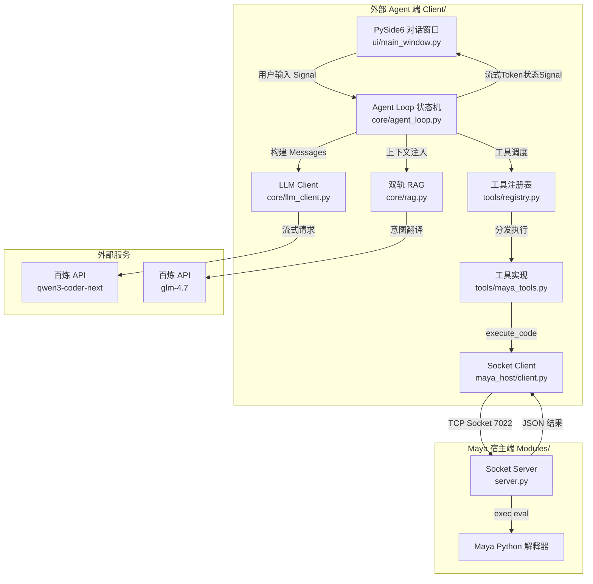
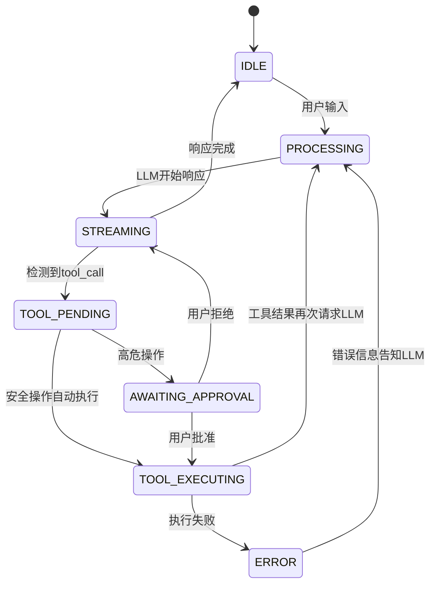

## Product Overview

Maya AI Agent V1.0 是一个基于"独立外部 Agent + Maya 宿主 commandPort"双进程架构的 Maya 智能助手。外部 Python 进程通过 TCP Socket 与 Maya 通信，结合阿里云百炼大模型（qwen3-coder-next / qwen3.5-plus）实现自然语言驱动的 Maya 场景操作、节点创建、属性查询等自动化能力。

## Core Features

1. **宿主通信管道**：外部 Agent 通过 TCP Socket 连接 Maya commandPort，发送 Python 代码并以结构化 JSON 格式获取执行结果，所有写操作自动包裹 Undo Chunk 实现可回退
2. **LLM 流式 Agent Loop**：基于状态机的流式处理循环，支持多次连续工具调用（Function Calling），具备死循环阻断机制
3. **三大基础工具**：场景选择上下文查询（只读）、自定义 Python 代码执行（兜底）、节点创建与属性连接（操作类），均提供 OpenAI 兼容 Function Schema
4. **双轨 RAG 系统**：轨道1自动收集场景上下文注入 System Prompt；轨道2使用 glm-4.7 将用户口语化描述翻译为 Maya 标准术语，匹配本地 maya.cmds 文档
5. **PySide6 对话界面**：独立窗口，Agent Loop 运行在 QThread 中，流式文字渲染，高危操作（写操作/自定义代码）弹出预览框等待用户批准后才执行

## Tech Stack

| 层面 | 技术选型 |
| --- | --- |
| 外部 Agent 运行时 | Python 3.10+, 独立环境 |
| UI 框架 | PySide6 |
| LLM 接入 | OpenAI SDK (阿里云百炼兼容) |
| 意图转义模型 | glm-4.7 (百炼 API) |
| 通信协议 | TCP Socket → Maya commandPort |
| 配置管理 | python-dotenv (.env) |
| Token 估算 | tiktoken (gpt-4 编码近似) |
| Maya 宿主端 | Maya 内置 Python (maya.cmds) |


## Implementation Approach

### 整体策略

采用严格分层、阶段递进的开发方式。每一层都是上一层的基础设施：通信层 → LLM 引擎层 → 工具/RAG 层 → UI 层。这确保了每个阶段可以独立测试验证。

### 关键技术决策

1. **边界标记协议设计**：Maya commandPort 的 stdout 会被 Maya 内部警告信息污染，因此采用 `MCP_JSON_START` / `MCP_JSON_END` 边界标记包裹结构化 JSON 返回值。Client 端使用正则提取。这比自定义二进制协议更简单可靠，且易于调试。

2. **状态机驱动的 Agent Loop**：而非简单的递归调用。状态包括 IDLE → STREAMING → TOOL_PENDING → AWAITING_APPROVAL → TOOL_EXECUTING → STREAMING。状态机设计让流程控制清晰，UI 可以在任意状态暂停/恢复，也便于实现高危操作审批。

3. **工具调用阻断机制**：维护一个滑动窗口（最近 N 次工具调用记录），如果相同工具+相同参数连续出现 3 次，自动中断循环并返回错误提示给 LLM。这防止了模型幻觉导致的死循环。

4. **双轨 RAG 中的 O(1) 匹配**：将 maya.cmds 文档预处理为 `{command_name: {synopsis, flags, examples}}` 的字典。glm-4.7 输出标准化关键词后，直接字典查找，无需向量数据库。这在 Maya 命令集（约600个）的规模下性能最优且零外部依赖。

5. **QThread + Signal 的 UI 架构**：Agent Loop 在 QThread 中运行，通过 Signal 将流式 token、工具调用状态、错误信息发送到 UI 主线程。高危操作时 QThread 内使用 QWaitCondition 阻塞等待 UI 线程的审批信号。

### 性能与可靠性考量

- **Socket 通信超时**：Client 端设置可配置的 socket timeout（默认 30s），长运行操作支持动态延长
- **LLM 流式响应**：使用 SSE 流式接收，逐 token 推送到 UI，避免长时间无响应
- **Undo Chunk 安全**：所有发送到 Maya 的代码自动包裹 try/finally + undoInfo，即使代码执行异常也能正确关闭 chunk
- **Token 预算管理**：对话历史超过 token 上限时，自动截断早期消息但保留 system prompt 和最近 N 轮

## Implementation Notes

1. **Maya commandPort 编码**：Maya 2022+ 默认 UTF-8，需要在 server.py 中显式指定 `echoOutput=True` 以确保返回值可被 socket 读取。发送代码末尾必须追加 `\n` 作为命令终止符。

2. **Socket 粘包处理**：Maya commandPort 可能将多条消息合并发送，Client 端需要基于边界标记做完整性校验，使用缓冲区累积直到检测到完整的 `MCP_JSON_START...MCP_JSON_END` 对。

3. **PySide6 线程安全**：绝不在 QThread 中直接操作 UI 控件，所有 UI 更新必须通过 Signal/Slot。高危操作审批使用 QMutex + QWaitCondition 而非 time.sleep 轮询。

4. **API Key 安全**：.env 文件加入 .gitignore，提供 .env.example 模板。代码中通过 os.getenv() 读取，避免硬编码。

5. **兼容已有 MCP 工具**：项目已有 DAMaya_MCP 工具集（query_scene_topology, get_selection_context, run_custom_diagnostic 等），Agent 的工具系统设计需考虑与这些 MCP 工具的接口一致性，未来可桥接。

## Architecture Design

### 系统架构



### 状态机设计



## Directory Structure

本项目从零构建，Client/ 为外部 Agent 端，Modules/ 为 Maya 宿主端。

```
DAMaya_Agent/
├── .env.example                    # [NEW] 环境变量模板，含 DASHSCOPE_API_KEY, MAYA_HOST, MAYA_PORT 等
├── .gitignore                      # [NEW] Git 忽略配置
├── requirements.txt                # [NEW] Python 依赖清单：openai, pyside6, python-dotenv, tiktoken
├── Client/
│   ├── __init__.py                 # [NEW] 包初始化
│   ├── run.py                      # [NEW] 启动入口。初始化 QApplication + MainWindow，处理命令行参数
│   ├── config.py                   # [NEW] 全局配置。python-dotenv 加载，Config dataclass
│   ├── core/
│   │   ├── __init__.py             # [NEW] 包初始化
│   │   ├── llm_client.py           # [NEW] LLM 客户端。OpenAI SDK 百炼 API，chat_stream()，Token 计数与截断
│   │   ├── agent_loop.py           # [NEW] Agent 核心引擎。状态机循环，tool_calls 分发，阻断机制，审批流程
│   │   └── rag.py                  # [NEW] 双轨 RAG。场景上下文注入 + glm-4.7 意图翻译 + 文档字典匹配
│   ├── maya_host/
│   │   ├── __init__.py             # [NEW] 包初始化
│   │   └── client.py               # [NEW] MayaSocketClient。TCP 连接、代码发送、缓冲区累积、JSON 提取
│   ├── tools/
│   │   ├── __init__.py             # [NEW] 包初始化
│   │   ├── registry.py             # [NEW] 工具注册表。BaseTool 抽象类 + ToolRegistry，OpenAI schema 输出
│   │   └── maya_tools.py           # [NEW] 三工具实现：QuerySelectionContext/RunCustomPython/CreateAndConnectNode
│   ├── ui/
│   │   ├── __init__.py             # [NEW] 包初始化
│   │   ├── main_window.py          # [NEW] PySide6 主窗口。聊天列表 + 输入框 + 状态栏
│   │   ├── chat_widget.py          # [NEW] 聊天气泡组件。Markdown/代码高亮/流式追加/工具卡片
│   │   ├── approval_dialog.py      # [NEW] 高危操作审批对话框。代码预览 + 批准/拒绝
│   │   └── worker_thread.py        # [NEW] QThread 封装。Signal 定义 + QMutex/QWaitCondition
│   └── data/
│       └── maya_cmds_docs.json     # [NEW] maya.cmds 命令文档字典，覆盖高频命令
├── Modules/
│   ├── __init__.py                 # [NEW] 包初始化
│   └── server.py                   # [NEW] Maya 端 commandPort 服务。TCP 端口/undoInfo 包裹/JSON 边界标记
├── Plan.md                         # [EXISTING] 开发蓝图
└── README.md                       # [MODIFY] 更新：安装指南、使用方法、架构说明
```

## Key Code Structures

### 1. MayaSocketClient 核心接口

```python
# Client/maya_host/client.py
from dataclasses import dataclass
from typing import Optional

@dataclass
class ExecutionResult:
    success: bool
    result: Optional[str]
    stdout: Optional[str]
    error: Optional[str]
    execution_time: float

class MayaSocketClient:
    def __init__(self, host: str = "127.0.0.1", port: int = 7022, timeout: float = 30.0): ...
    def connect(self) -> bool: ...
    def disconnect(self) -> None: ...
    def is_connected(self) -> bool: ...
    def execute_code(self, code: str, timeout: Optional[float] = None) -> ExecutionResult: ...
```

### 2. Agent Loop 状态与回调协议

```python
# Client/core/agent_loop.py
from enum import Enum, auto
from typing import Protocol

class AgentState(Enum):
    IDLE = auto()
    PROCESSING = auto()
    STREAMING = auto()
    TOOL_PENDING = auto()
    AWAITING_APPROVAL = auto()
    TOOL_EXECUTING = auto()
    ERROR = auto()

class AgentCallbacks(Protocol):
    def on_text_chunk(self, text: str) -> None: ...
    def on_tool_call(self, tool_name: str, arguments: dict) -> None: ...
    def on_approval_required(self, tool_name: str, code_preview: str) -> bool: ...
    def on_tool_result(self, tool_name: str, result: dict) -> None: ...
    def on_error(self, error: str) -> None: ...
    def on_complete(self) -> None: ...
```

### 3. 工具注册表接口

```python
# Client/tools/registry.py
from abc import ABC, abstractmethod
from typing import List

class BaseTool(ABC):
    name: str
    description: str
    is_dangerous: bool = False

    @abstractmethod
    def get_schema(self) -> dict: ...

    @abstractmethod
    def execute(self, **kwargs) -> dict: ...

class ToolRegistry:
    def register(self, tool: BaseTool) -> None: ...
    def get_tool(self, name: str) -> BaseTool: ...
    def get_all_schemas(self) -> List[dict]: ...
```

## Design Style

本项目 UI 使用 PySide6 原生构建（非 Web 前端），以下为 UI 视觉风格指导。

### 整体风格

采用深色主题 + 科技感的现代对话界面，类似 ChatGPT / Claude 桌面端风格。简洁专注，以对话内容为核心。

### 主窗口布局

**顶部状态栏**：左侧 Maya AI Agent 标题，右侧连接状态圆点（绿色=已连接/红色=断开）+ 设置齿轮图标。

**中部聊天区域**：用户消息右对齐浅蓝气泡，AI 回复左对齐深灰气泡。工具调用折叠卡片（图标+工具名+状态标签）。代码块等宽字体+深色背景+语法高亮。

**审批浮层**：高危操作时弹出橙色边框卡片，代码语法高亮预览，配批准（绿色）和拒绝（红色）按钮。

**底部输入区**：圆角输入框 + 发送按钮，Shift+Enter 换行，Enter 发送。

## Agent Extensions

### MCP

- **DAMaya_MCP**
- Purpose: 利用现有 MCP 工具（get_selection_context, run_custom_diagnostic, query_scene_topology 等）验证 Socket 通信层正确性，并作为 Agent 内置工具接口设计的参考蓝本
- Expected outcome: 验证通信协议正确性；工具接口格式保持一致性

### SubAgent

- **code-explorer**
- Purpose: 跨多文件搜索代码模式、检查接口一致性、验证模块间导入路径
- Expected outcome: 确保各层模块接口对齐，导入依赖正确